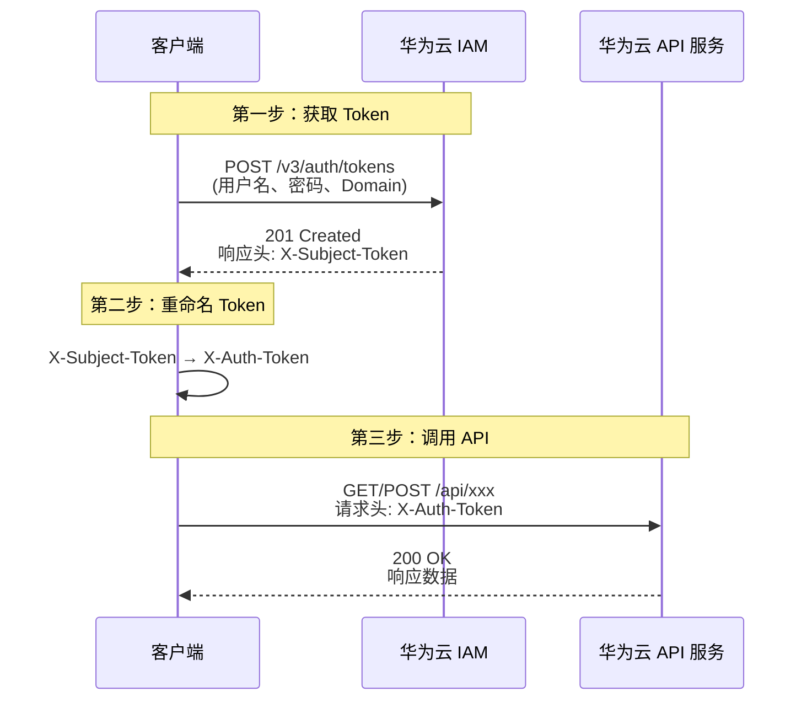

# 华为云 IAM Token 认证与 API 调用测试

## 📋 概述

本项目用于测试华为云 IAM（Identity and Access Management）认证流程：
1. 通过 POST 请求获取 `X-Subject-Token`
2. 将 `X-Subject-Token` 重命名为 `X-Auth-Token`
3. 使用 `X-Auth-Token` 调用华为云 API

---

## 🔐 认证信息

| 字段 | 值 |
|------|-----|
| IAM 用户名 | `gzlg017` |
| 账号名 (Domain) | `sziit2024` |
| 密码 | `Hngy@123456` |

> ⚠️ **安全提醒**：请勿将包含密码的配置文件提交到版本控制系统。建议将 `token获取` 文件加入 `.gitignore`。

---

## 🌐 API 端点

### 1. 获取 Token（IAM 认证）

| 属性 | 值 |
|------|-----|
| **方法** | `POST` |
| **URL** | `https://iam.myhuaweicloud.com/v3/auth/tokens` |
| **Content-Type** | `application/json; charset=utf-8` |

#### 请求体结构

```json
{
    "auth": {
        "identity": {
            "methods": ["password"],
            "password": {
                "user": {
                    "name": "IAM用户名",
                    "password": "IAM用户密码",
                    "domain": {
                        "name": "所属账号名"
                    }
                }
            }
        },
        "scope": {
            "domain": {
                "name": "所属账号名"
            }
        }
    }
}
```

#### 响应说明

| 项目 | 说明 |
|------|------|
| **HTTP Status** | `201 Created` 表示成功 |
| **响应头** | `X-Subject-Token` — 这就是我们需要获取的 Token |
| **响应体** | JSON 格式，包含 token 详细信息、过期时间、用户信息等 |

---

### 2. Token 转换规则

```
响应头中的 X-Subject-Token  →  重命名为 X-Auth-Token  →  用于后续 API 请求头
```

后续调用华为云 API 时，请求头格式为：

```
X-Auth-Token: <从 X-Subject-Token 获取的值>
Content-Type: application/json; charset=utf-8
```

---

## 🔄 完整流程图



---

## 📁 项目文件结构

```
post测试/
├── README.md              # 本文档
├── token获取              # 认证配置（JSON 格式）
├── requirements.txt       # Python 依赖
│
├── get_token.py           # Python：获取 Token
├── call_api.py            # Python：调用 API
│
├── get_token.ps1          # PowerShell：获取 Token
├── call_api.ps1           # PowerShell：调用 API
│
├── token_response.json    # 运行后生成：Token 缓存
└── api_response.json      # 运行后生成：API 响应缓存
```

---

## 🚀 快速开始

### 前置要求

- **Python 3.7+**
- 网络可访问华为云 IAM 端点

### 安装依赖

```bash
pip install -r requirements.txt
```

### 步骤 1：获取 Token

```bash
python get_token.py
```

成功后将看到：
```
✅ Token 获取成功！
X-Subject-Token: gAAAAAB...
Token 过期时间: 2026-06-28T...
```

Token 会自动保存到 `token_response.json`，其中包含两个字段：
- `X_Subject_Token`：从响应头 `X-Subject-Token` 获取的原始值
- `X_Auth_Token`：重命名后用于后续 API 调用的值（与上面相同）

### 步骤 2：调用 API

```bash
# 交互式选择 API
python call_api.py

# 命令行指定参数
python call_api.py --url "https://iam.myhuaweicloud.com/v3/users" --method GET

# 带请求体的 POST 调用
python call_api.py --url "https://xxx.myhuaweicloud.com/v1/resource" --method POST --body '{"key":"value"}'
```

### PowerShell 用户

也可使用同目录下的 PowerShell 脚本（Windows 自带）：

```powershell
.\get_token.ps1
.\call_api.ps1
```

---

## 📝 Token 响应体关键字段说明

| 字段路径 | 说明 |
|----------|------|
| `token.expires_at` | Token 过期时间（ISO 8601 格式） |
| `token.issued_at` | Token 签发时间 |
| `token.user.name` | IAM 用户名 |
| `token.user.domain.name` | 所属账号名 |
| `token.catalog` | 服务目录（可用服务列表） |
| `token.catalog[].endpoints` | 各服务的 API 端点地址 |

---

## ⚠️ 注意事项

1. **Token 有效期**：华为云 IAM Token 默认有效期为 **24 小时**，过期后需重新获取
2. **安全传输**：所有请求必须使用 HTTPS
3. **密码保护**：请勿将密码硬编码在脚本中，建议使用环境变量或配置文件
4. **请求频率**：避免频繁获取 Token，建议缓存并在过期前刷新
5. **错误处理**：
   - `401 Unauthorized`：认证信息错误（用户名/密码/域名）
   - `403 Forbidden`：权限不足
   - `404 Not Found`：API 端点不存在

---

## 📚 参考文档

- [华为云 IAM 获取用户 Token](https://support.huaweicloud.com/api-iam/iam_30_0001.html)
- [华为云 API 调用认证](https://support.huaweicloud.com/api-iam/iam_17_0005.html)
